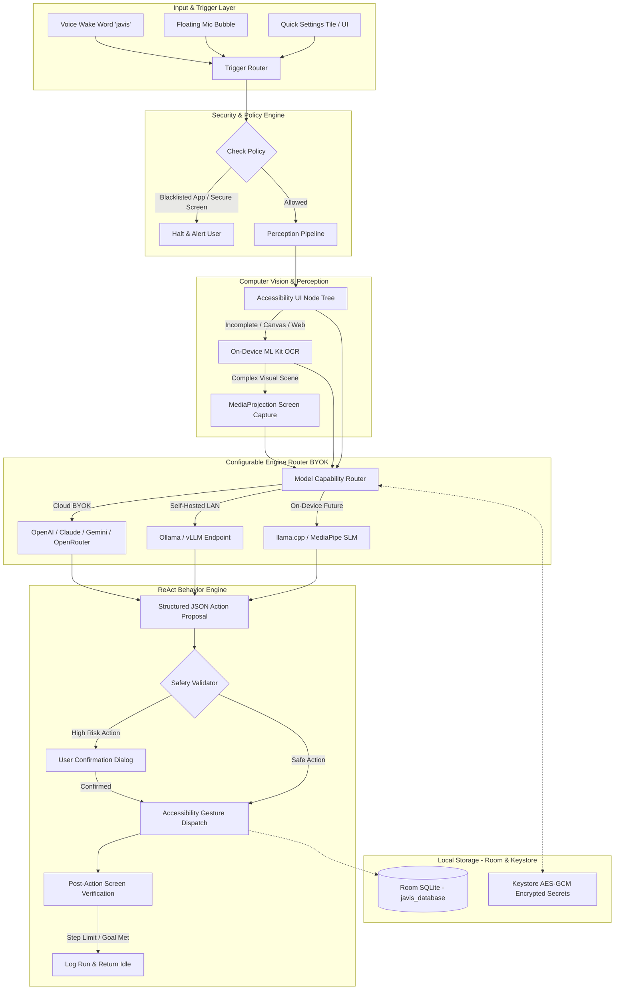

# JAVIS All-In-One Architecture Plan: Local-First, Computer Vision & Behavior Agent

**Target Document:** `javis-android/plan/all-in-one-local-first-vision-behavior-plan.md`  
**Status:** Architectural Blueprint & Implementation Roadmap  
**Scope:** Standalone Android APK (No backend server, no external database setup required, user-configurable AI models).

---

## 1. Executive Summary & Core Principles

The objective is to upgrade **JAVIS** into an all-in-one, local-first assistant capable of screen comprehension (Computer Vision) and multi-step task execution (Behavior Agent), while retaining full autonomy as a standalone client APK:

1. **Zero Server Footprint:** No dedicated backend server. Room (SQLite) runs entirely on-device inside the app process. Users never configure a database server.
2. **Bring Your Own Key (BYOK) & Configurable Engines:** Users bring their own API keys (OpenAI, Anthropic, Google Gemini, Groq, OpenRouter) or point to private self-hosted endpoints (Ollama, vLLM, LocalAI) via in-app Settings.
3. **Local-First Distinction:** "Local-first" means local data ownership, local configuration, and local UI tree/OCR preprocessing. It does **not** mean 100% offline when using cloud VLMs; external calls send authorized screen data to user-chosen providers and incur user token costs.
4. **On-Device VLM as Phased Track:** On-device multimodal models (e.g., via llama.cpp or MediaPipe GenAI) require verified runtimes, compatible vision projectors, quantized weights, and hardware constraints. They are scheduled for a dedicated phase rather than promising unverified arbitrary `.gguf` loading.
5. **Preserve Existing Stack (YAGNI):** Do not rewrite existing ViewBinding/XML UI to Jetpack Compose or OkHttp to Ktor. Maximize existing dependencies, Room 2.6.1, OkHttp 4.12.0, Kotlin coroutines, and ONNX Runtime.
6. **Strict Non-Negotiables from JAVIS Core:**
   - Wake word `javis` powered by on-device openWakeWord.
   - 100 ms confirmation beep; zero audio focus disruption to prevent stopping TikTok / Shorts / Reels video playback.
   - Retain Accessibility Service, Quick Settings Tile, Floating Mic Bubble, direct phone calls, SMS handling, AI chat, and Room custom commands.
   - All user-facing UI copy, alerts, and TTS output must remain in Vietnamese.

---

## 2. Current Codebase Baseline

| Component | Current File | Current State | Target Evolution |
|---|---|---|---|
| **Build Config** | `app/build.gradle.kts` | `minSdk 26`, `targetSdk 34`, `compileSdk 35`, ViewBinding enabled. | Add ML Kit Text Recognition, Security Crypto; keep Kotlin/XML. |
| **Local Database** | `app/src/main/java/com/dinh/javis/data/AppDatabase.kt` | Room v1, single entity `CustomCommand`, `exportSchema = false`. | Incremental schema migration (v1 -> v2) with explicit migrations; keep `javis_database`. |
| **Settings Storage** | `app/src/main/java/com/dinh/javis/data/PreferenceManager.kt` | Plain `SharedPreferences` storing Base URL, API key, model, wakeword flags. | Separate sensitive secrets (Keystore AES-GCM) from non-sensitive settings. |
| **Settings UI** | `app/src/main/java/com/dinh/javis/settings/SettingsActivity.kt` | XML ViewBinding activity editing Base URL, API Key, Model. | Add Model Profiles, Vision toggle, App Whitelist/Blacklist, and Connection Test. |
| **LLM Client** | `app/src/main/java/com/dinh/javis/ai/OpenAiClient.kt` | Text-only OkHttp client targeting `/chat/completions`. | Split into capability contracts: Chat, Vision, Planning. Support OpenAI-compatible schemas. |
| **Automation & UI** | `app/src/main/java/com/dinh/javis/service/JavisAccessibilityService.kt` | Accessibility gestures, scroll, click, global actions. | Expand with node hierarchy dumper, safe action dispatch, and state verification. |

---

## 3. Scope & Phasing Matrix

### In-Scope: MVP (Phase 1 & 2)
- Room database migration preserving existing custom commands.
- Secure on-device credential storage via Android Keystore AES-GCM.
- In-app model profiles: configurable Base URL, API Key, Chat Model, Vision Model, Planning Model.
- OpenAI-compatible Vision API client supporting structured Set-of-Marks or annotated coordinates.
- Hierarchical screen perception: Accessibility Node Tree first -> On-device ML Kit OCR fallback.
- Screen capture via `MediaProjection` adhering strictly to Android 14+ per-session consent and foreground service constraints.
- ReAct Agent execution loop with rigid safety guardrails (Denylist, confirmation prompts, max step limits).
- Local deterministic behavior aggregation (task frequency, failure stats, user macro suggestions).

### In-Scope: Post-MVP (Phase 3)
- Dedicated native provider adapters (Anthropic Claude native messages format, Google Gemini native SDK/API).
- On-device VLM integration (llama.cpp Android bindings / MediaPipe GenAI) with validated quant models.
- Model file download and integrity verification manager.
- Advanced gesture recorder and macro builder.

### Out of Scope (Explicit Guardrails)
- Global background screen surveillance or background keylogging.
- Bypassing Android `FLAG_SECURE` (banking screens, password fields).
- Autonomous execution of sensitive financial transactions, payment approvals, OTP submission, or app installations without explicit human confirmation.
- Proprietary external cloud sync or user telemetry collection.

---

## 4. System Architecture



---

## 5. Storage & Security Architecture

### 5.1 Room Database Expansion (`javis_database`)

All tables reside locally on-device. No cloud sync.

```
+------------------------------------------------------------------------+
|                               Room DB v2                               |
+------------------------------------+-----------------------------------+
| CustomCommand (Existing v1 entity) | TaskProfile (Predefined workflows)|
| - id: Long                         | - id: String                      |
| - triggerPhrase: String            | - name: String                    |
| - actionType: String               | - allowedPackages: List<String>   |
| - actionData: String               | - maxSteps: Int                   |
+------------------------------------+-----------------------------------+
| AiModelProfile (BYOK Endpoints)    | TaskRun (Execution history)       |
| - id: String                       | - runId: String                   |
| - name: String                     | - profileId: String               |
| - providerType: String             | - startTime: Long, endTime: Long  |
| - baseUrl: String                  | - status: SUCCESS|FAILED|CANCELLED |
| - secretKeyAlias: String (Keystore)| - stepCount: Int                  |
| - chatModelId: String              +-----------------------------------+
| - visionModelId: String            | ActionLog (Audit trail)           |
| - planningModelId: String          | - actionId: Long, runId: String   |
+------------------------------------+ - actionType: CLICK|SCROLL|INPUT  |
| PolicyRule (App Guardrails)        | - targetPackage: String           |
| - packageName: String              | - sanitizedDetails: String        |
| - policy: ALLOW | DENY | REQUIRE_CONFIRM | - timestamp: Long           |
+------------------------------------+-----------------------------------+
| BehaviorAggregate (Aggregated stats)                                   |
| - taskKey: String, date: String, runCount: Int, failureCount: Int      |
+------------------------------------------------------------------------+
```

### 5.2 Secret Management Strategy
- **Master Key:** Android Keystore generating 256-bit AES cipher (`AndroidKeyStore`, `AES/GCM/NoPadding`).
- **Storage:** Ciphertext and IV stored in dedicated secure private preferences or encrypted database columns.
- **Migration Safeguard:**
  1. Read existing `openAiApiKey` from plain `SharedPreferences`.
  2. If non-empty, encrypt using Keystore AES-GCM.
  3. Write ciphertext and verify successful decrypt roundtrip.
  4. Create default `AiModelProfile` linked to key alias.
  5. Clear plaintext key from `SharedPreferences`.

### 5.3 Data Retention & Privacy
- **Screenshots:** Transient in-memory bitmaps only. Recycled immediately after inference. **Never persisted to disk.**
- **Action Logs:** Auto-purged after 7 days.
- **Behavior Aggregates:** Retained for 30 days; contain zero OCR text or coordinates.
- **Backup Exclusion:** Keystore aliases and database files must be explicitly flagged with `android:allowBackup="false"` or configured via `res/xml/backup_rules.xml` to prevent leaking encrypted artifacts to unmanaged clouds.

---

## 6. Vision Pipeline: Multi-Layer Screen Perception

To optimize latency, battery, and token cost, vision processing follows an escalating 3-layer pipeline:

```
[Layer 1: Semantic Node Tree] (Latency: ~5-15ms | Cost: $0.00 | Local: 100%)
       │
       ▼ Text or clickable node identified?
       ├── Yes ──> Route directly to Planner / CommandExecutor
       └── No  ──>
[Layer 2: On-Device ML Kit OCR] (Latency: ~40-90ms | Cost: $0.00 | Local: 100%)
       │
       ▼ Bounding box & text extracted?
       ├── Yes ──> Calculate bounding center coordinate -> Action
       └── No  ──>
[Layer 3: Vision Language Model (VLM)] (Latency: ~800-2500ms | BYOK Token Cost)
       │
       └── Downscale & Compress Screenshot (JPEG 75%, 720p-1080p)
           Annotate with Set-of-Marks (SoM) if coordinates needed
           Dispatch to Configured Vision Model (OpenAI-compatible / Custom)
```

### 6.1 Android 14+ MediaProjection Lifecycle Requirements
- **Permission Scope:** Screen capture requires explicit `MediaProjectionManager.createScreenCaptureIntent()` consent.
- **Android 14+ Rule:** Per-session consent token must not be reused across distinct user sessions.
- **Foreground Service:** Screen capture requires an active Foreground Service with `android:foregroundServiceType="mediaProjection"`.
- **Termination Guards:** Automatically stop and release `VirtualDisplay` and `ImageReader` whenever:
  - Screen turns off or keyguard engages.
  - The foreground app changes to a blacklisted package.
  - Task execution terminates or user clicks Stop on the floating bubble.

---

## 7. Configurable Model Engine & BYOK Router

### 7.1 Decoupled Capability Contracts

```kotlin
interface ChatCapability {
    suspend fun chat(messages: List<ChatMessage>, options: ModelOptions): String
}

interface VisionCapability {
    suspend fun analyzeScreen(
        prompt: String,
        bitmap: Bitmap,
        nodeContext: String?,
        options: ModelOptions
    ): VisionAnalysisResult
}

interface PlanningCapability {
    suspend fun planNextAction(
        taskGoal: String,
        screenSummary: ScreenObservation,
        history: List<ActionSummary>,
        options: ModelOptions
    ): ActionPlanResult
}
```

### 7.2 Model Engine Options
1. **Cloud Commercial BYOK (OpenAI-compatible endpoint):**
   - Standard `/v1/chat/completions` supporting multimodal payloads (`image_url` with base64 data).
   - Supports: OpenAI (`gpt-4o`, `gpt-4o-mini`), Groq Vision, OpenRouter, DeepSeek (via compatible gateways).
2. **Private LAN / Self-Hosted Endpoints:**
   - Supports local desktop instances running Ollama (`qwen2.5-vl`, `llava`) or vLLM.
   - Authentication key optional.
   - Cleartext HTTP allowed **only** for RFC1918 private LAN IP ranges (192.168.x.x, 10.x.x.x, 172.16.x.x) via strict Network Security Config; public domains mandate HTTPS.
3. **On-Device SLM (Phase 3 Track):**
   - Verified integration via quantized ONNX/TFLite/llama.cpp NDK bindings once memory footprint (< 2GB RAM) and latency (< 2.5s) benchmarks are satisfied on target devices (e.g. OPPO Find X8 Ultra).

---

## 8. Behavior Analysis & ReAct Agent Loop

### 8.1 ReAct State Machine

```
[IDLE] ──(User Voice/UI Command)──> [PREFLIGHT]
                                        │
           ┌────────────────────────────┴────────────────────────────┐
           ▼                                                         ▼
[SECURITY_VIOLATION] ──> Notify Vietnamese                [OBSERVE_SCREEN]
                                                                     │
                                                                     ▼
                                                             [PLAN_STEP]
                                                                     │
                                                                     ▼
                                                            [VALIDATE_ACTION]
                                                                     │
                         ┌───────────────────────────────────────────┴───────────────────────────┐
                         ▼                                                                       ▼
               [REQUIRES_CONFIRMATION]                                                     [EXECUTE_GESTURE]
                         │                                                                       │
         ┌───────────────┴───────────────┐                                                       ▼
         ▼                               ▼                                               [VERIFY_EFFECT]
     [DENIED] ──> Cancel Run         [APPROVED] ──> [EXECUTE_GESTURE]                            │
                                                                     ┌───────────────────────────┴───────────────────────────┐
                                                                     ▼                                                       ▼
                                                             [GOAL_REACHED]                                         [NEXT_STEP_LOOP]
                                                                     │                                              (Step < MaxLimit)
                                                                     ▼                                                       │
                                                                  [IDLE] <───────────────────────────────────────────────────┘
```

### 8.2 Strict Operational Guardrails
- **Max Step Bounding:** Default 8 steps per goal; hard timeout 60 seconds.
- **Denylist Packages:** Instant abort if active package matches:
  - Banking & Finance apps (`com.vietcombank.*`, `com.mbmobile`, etc.).
  - Crypto wallets & Password managers (`com.onepassword.*`, `keepass`, etc.).
  - System package installer / permission dialogs.
- **Untrusted Screen Content:** Text visible on screen is treated strictly as data, never as system instructions (guards against prompt injection via web/social posts).
- **Format Enforcement:** Planning LLM must output strict JSON adhering to a sealed schema:
  ```json
  {
    "thought": "Short explanation",
    "action": "CLICK" | "SCROLL" | "TYPE" | "WAIT" | "TERMINATE",
    "params": {
      "x": 540,
      "y": 1200,
      "text": "",
      "direction": "DOWN"
    },
    "isGoalComplete": false
  }
  ```
  Arbitrary code, shell commands, or unparsed reflection scripts are rejected.

---

## 9. Implementation Phasing & Work Breakdown

### Phase 1: Storage & Security Foundation
- Update `AppDatabase` to Room v2 with incremental migrations for `task_profiles`, `ai_profiles`, `action_logs`, and `policy_rules`.
- Implement `KeystoreManager` for AES-GCM credential encryption.
- Refactor `PreferenceManager` to migrate existing plain OpenAI key into encrypted store without data loss.
- Unit tests: Room migration test from v1 -> v2; Keystore encrypt/decrypt roundtrip.

### Phase 2: In-App Settings & Model Router (BYOK)
- Build Settings screens for Model Profiles (Name, Base URL, API Key, Model IDs, Provider).
- Create `ModelRouter` and `OpenAiCompatibleClient` supporting both Chat and Multimodal Vision payloads.
- Implement "Test Connection" button with synthetic test payload and token usage warning.
- Unit/Integration tests: Mock HTTP server testing OpenAI-compatible chat and vision serialization.

### Phase 3: Screen Perception & Vision Pipeline
- Integrate Google ML Kit Text Recognition (`com.google.android.gms:play-services-mlkit-text-recognition` or bundled model equivalent).
- Implement `ScreenObservationEngine`:
  - Fast node tree parser in `JavisAccessibilityService`.
  - Local OCR fallback for canvas/webview regions.
  - `MediaProjection` capture manager with foreground service binding and Android 14 per-session lifecycle handling.
- Coordinate transformation utility mapping screenshot coordinates to physical display resolution and orientation.

### Phase 4: ReAct Agent & Safety Guardrails
- Build `AgentOrchestrator` state machine.
- Implement `PolicyGuard`:
  - Default package blacklist.
  - Sensitive keyword scanner (password, OTP, CVV).
- Connect `CommandExecutor` to dispatch verified gestures: tap at (x, y), scroll, swipe, text input.
- User confirmation overlay dialog for intermediate high-risk actions.
- End-to-end testing of 3 standard multi-step scenarios on target test devices (e.g. searching a song on YouTube, reading an article).

### Phase 5: Local Behavior Analytics & Optimization
- Implement `BehaviorAggregator` to count task frequencies and failure points.
- Create UI section in Settings for "Lịch sử tác vụ" (Task History) with manual "Xóa toàn bộ" (Purge) option.
- Validate non-interference with openWakeWord background hotword detection and 100ms beep audio policy.

---

## 10. Acceptance Criteria & Definition of Done (DoD)

1. **Independent APK Operation:**
   - App installs and operates standalone without any JAVIS backend server.
   - User successfully configures a custom BYOK endpoint in Settings.
2. **Preservation of Existing JAVIS Features:**
   - Saying "javis" triggers wake state with 100ms beep.
   - Continuous audio capture does not pause TikTok/YouTube playback.
   - All legacy voice commands (call, SMS, open app, custom database commands) execute without regression.
3. **Data Security & Privacy Compliance:**
   - API keys are never stored in plaintext and never leaked into logcat.
   - No screenshots written to persistent flash storage.
   - Blacklisted apps instantly halt the agent loop.
4. **Resilience & Bounds:**
   - Agent terminates cleanly upon reaching step limit (8 steps) or timeout (60s).
   - Rotating the screen or pressing the power button terminates active screen capture immediately.
5. **Localization:**
   - 100% of user-facing strings, toasts, confirmation dialogs, and TTS voice feedback are in Vietnamese.
